# Access and permissions

In addition to providing a single sign on solution for the GOV.UK publishing app suite, Signon can be used to manage users' access to apps and the permissions they have for each app. The permissions can then be used within specific non-Signon apps to dictate behaviour. This document provides a primer on key parts of how the management of access and permissions is implemented.

## Section notes

### What can you do?

Each "What can you do?" section provides a breakdown of the actions a given user (a 'granter') can take to manage access to and permissions for an app for a given user (a 'grantee').

The granter is either:

- a GOV.UK admin, meaning a user with the role "Superadmin" or "Admin"; or
- a publishing manager, meaning a user with the role "Super organisation admin" or "Organisation admin"

Each row represents an app with certain permissions set as delegatable, as indicated by the "Delegatable permissions" column. The "Grant access" column indicates whether a granter can give a grantee the `signin` permission, and the "Revoke access" column relates to removing the `signin` permission.

### Dependencies by route

Each "Dependencies by route" section provides a breakdown of which actions are determined by dependencies and a tree or trees of relevant dependencies. The aim of this section isn't to go all the way down every node of each dependency tree, but rather to provide enough context on what determines what you can do, and to make it easier to identify shared dependencies. There's a particular focus on the different policies that are hit by each route, since the policies are both fundamental to how everything works and the source of a lot of complexity.

## For the current user (self)

In this section, the granter and grantee are the same user: this is about managing your own access and permissions.

### What can you do?

#### As a GOV.UK admin

| Delegatable permissions | Grant access | Revoke access | Edit permissions | View permissions |
|-------------------------|--------------|---------------|------------------|------------------|
| None                    | ✅            | ✅             | ✅                | ✅                |
| `signin`                | ✅            | ✅             | ✅                | ✅                |
| Another permission      | ✅            | ✅             | ✅                | ✅                |

#### As a publishing manager

| Delegatable permissions | Grant access | Revoke access | Edit permissions | View permissions |
|-------------------------|--------------|---------------|------------------|------------------|
| None                    | ❌            | ❌             | ❌                | ✅                |
| `signin`                | ❌            | ✅             | ❌                | ✅                |
| Another permission      | ❌            | ❌             | ✅*               | ✅                |

\* only delegatable non-signin permissions

### Dependencies by route

#### Account applications show

These dependencies determine whether a user can:

- be redirected to the index

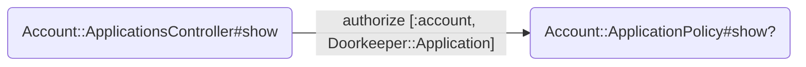

#### Account applications index

These dependencies determine whether a user can:

- access the page
- see a link to grant access to an given app
- see a link to revoke access to an given app
- see a link to edit or view permissions for a given app

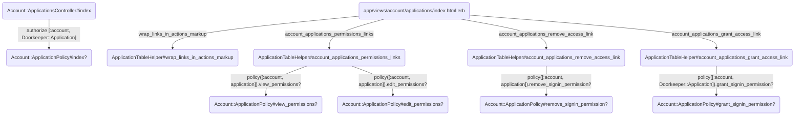

#### Account permissions show

These dependencies determine whether a user can:

- access the page
- see a list of (all) permissions

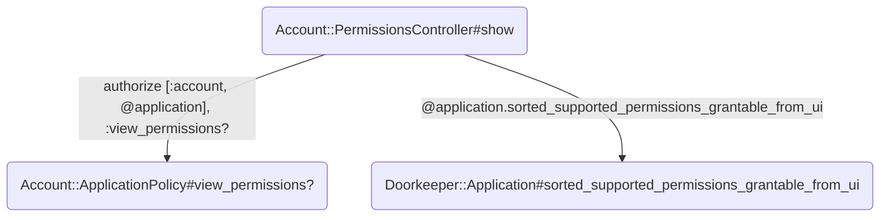

#### Account permissions edit

These dependencies determine whether a user can:

- access the page
- manage (non-`signin`) permissions

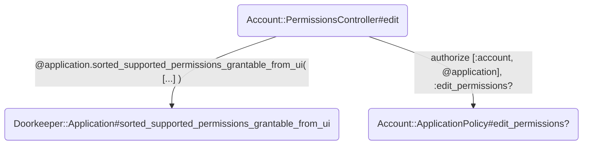

#### Account permissions update

These dependencies determine whether a user can:

- complete the controller action
- update certain permissions

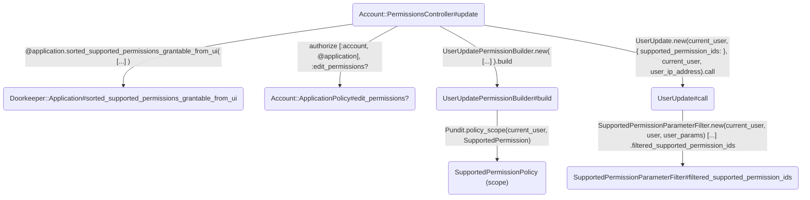

#### Account signin permissions create

These dependencies determine whether a user can:

- complete the controller action
- grant themself access to an app

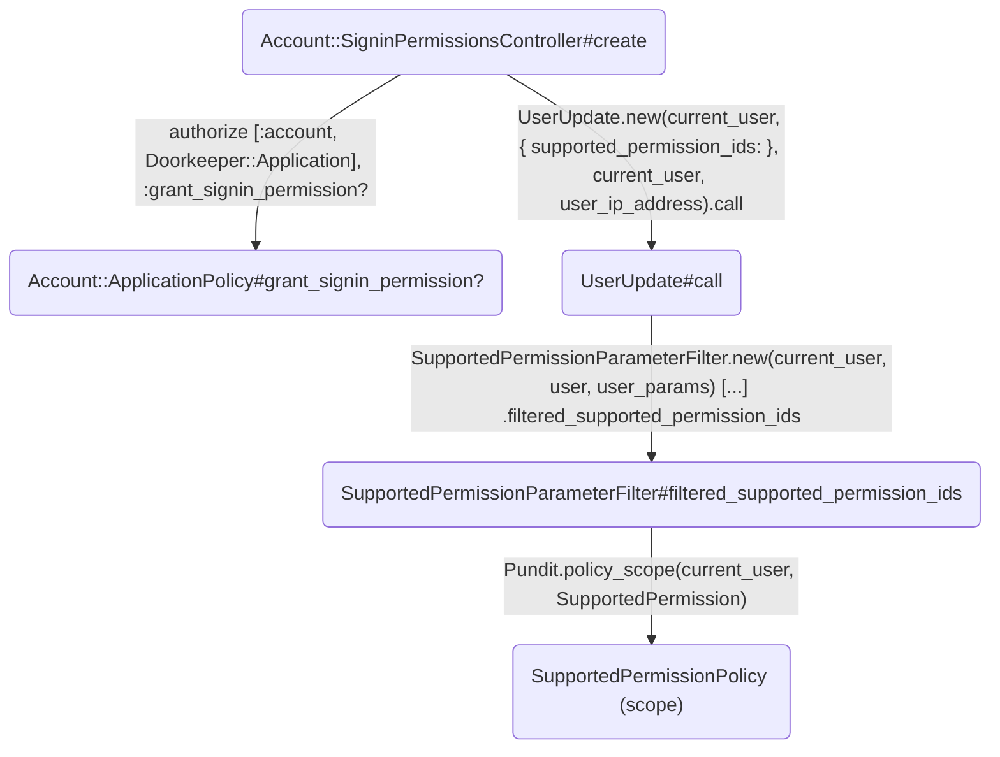

#### Account signin permissions delete

These dependencies determine whether a user can:

- view the confirmation screen for revoking access to a given app

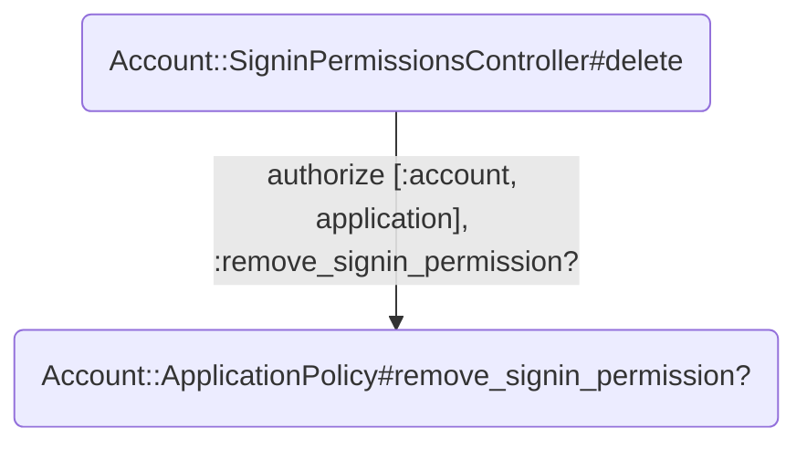

#### Account signin permissions destroy

These dependencies determine whether a user can:

- complete the controller action
- revoke access to a given app

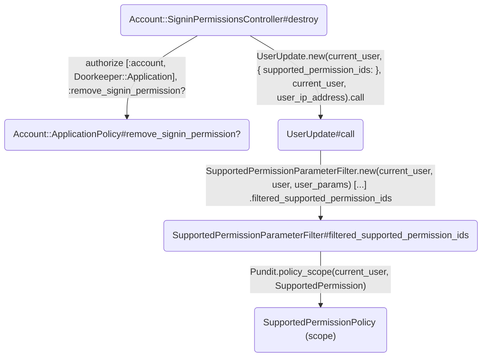

## For another existing user

In this section, the granter and grantee are different users: this is about managing another user's access and permissions.

### What can you do?

#### As a GOV.UK admin

##### With or without access to the app

| Delegatable permissions | Grant access | Revoke access | Edit permissions | View permissions |
|-------------------------|--------------|---------------|------------------|------------------|
| None                    | ✅            | ✅             | ✅                | ✅                |
| `signin`                | ✅            | ✅             | ✅                | ✅                |
| Another permission      | ✅            | ✅             | ✅                | ✅                |

#### As a publishing manager

##### With access to the app

| Delegatable permissions | Grant access | Revoke access | Edit permissions | View permissions |
|-------------------------|--------------|---------------|------------------|------------------|
| None                    | ❌            | ❌             | ❌                | ✅                |
| `signin`                | ✅            | ✅             | ❌                | ✅                |
| Another permission      | ❌            | ❌             | ✅*               | ✅                |

\* only delegatable non-signin permissions

##### Without access to the app

| Delegatable permissions | Grant access | Revoke access | Edit permissions | View permissions |
|-------------------------|--------------|---------------|------------------|------------------|
| None                    | ❌            | ❌             | ❌                | ✅                |
| `signin`                | ❌            | ❌             | ❌                | ✅                |
| Another permission      | ❌            | ❌             | ❌                | ✅                |

### Dependencies by route

#### Users applications show

These dependencies determine whether a user can:

- be redirected to the index

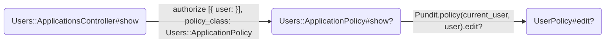

#### Users applications index

These dependencies determine whether a user can:

- access the page
- see a link to grant access to an given app
- see a link to revoke access to an given app
- see a link to edit or view permissions for a given app

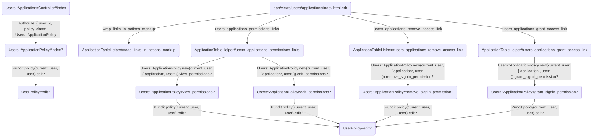

#### Users permissions show

These dependencies determine whether a user can:

- access the page
- see a list of (all) permissions

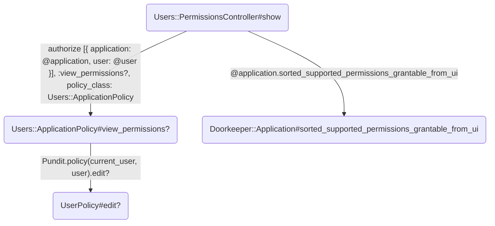

#### Users permissions edit

These dependencies determine whether a user can:

- access the page
- manage (non-`signin`) permissions

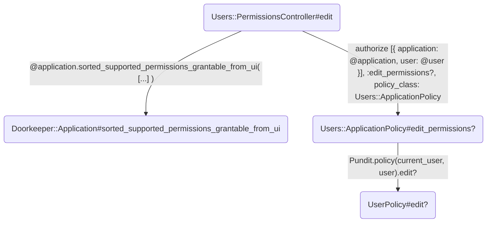

#### Users permissions update

These dependencies determine whether a user can:

- complete the controller action
- update certain permissions

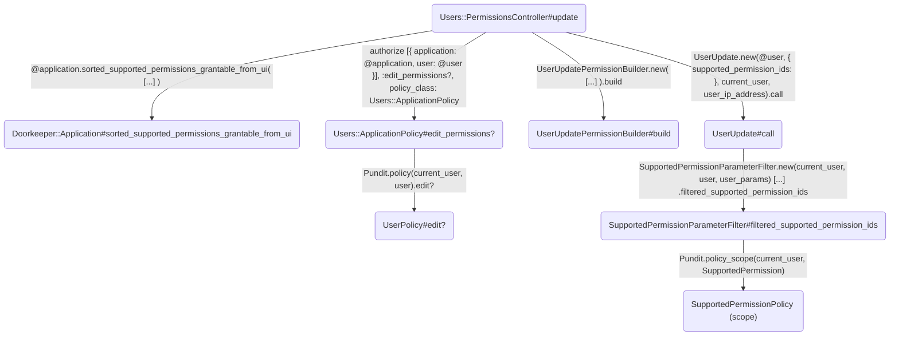

#### Users signin permissions create

These dependencies determine whether a user can:

- complete the controller action
- grant a given user access to an app

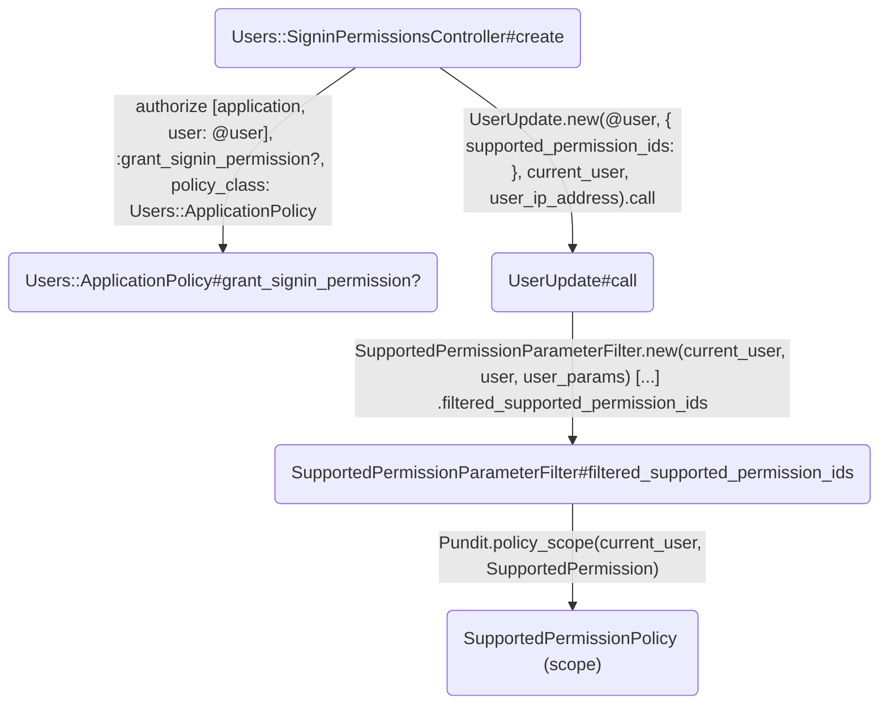

#### Users signin permissions delete

These dependencies determine whether a user can:

- view the confirmation screen for revoking access to a given app

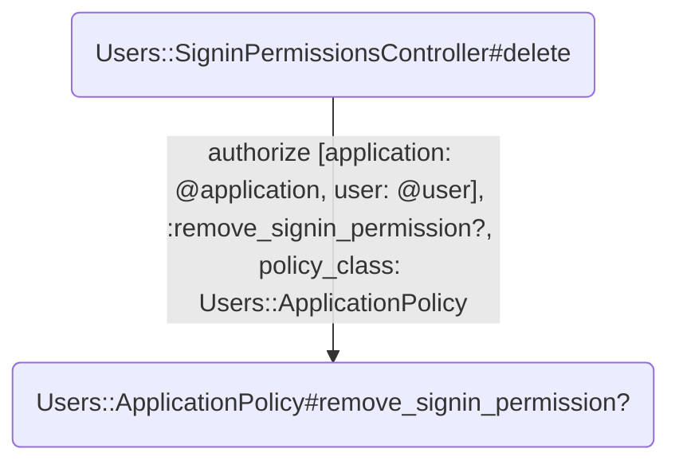

#### Users signin permissions destroy

These dependencies determine whether a user can:

- complete the controller action
- revoke access to a given app

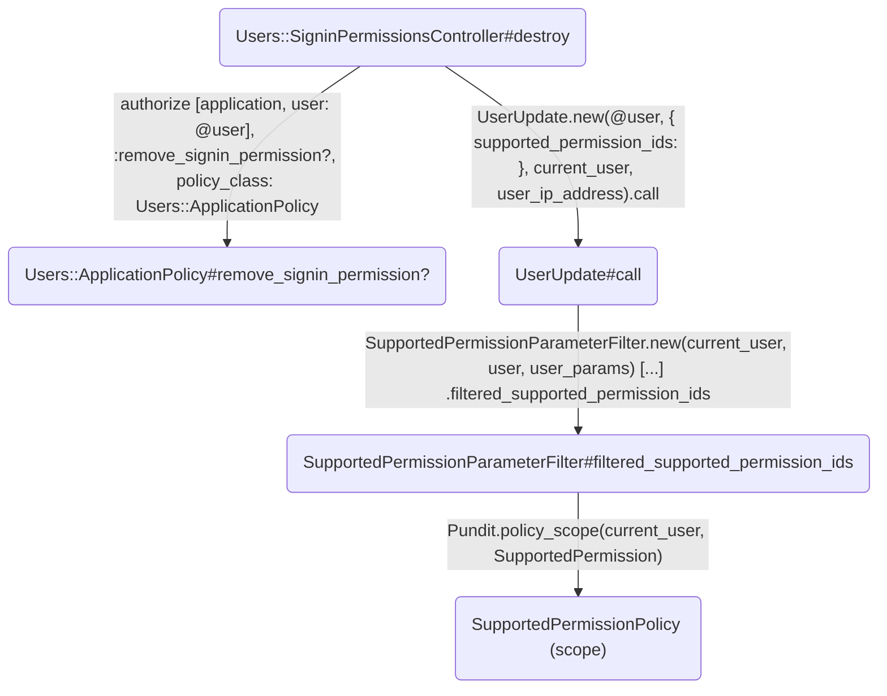

## For a new user

### What can you do?

The following actions are taken in the process of inviting a new user - once the invitation is sent, refer to the [For another existing user](#for-another-existing-user) section.

#### As a GOV.UK admin

| Send invitation | Grant access | Edit permissions |
|-----------------|--------------|------------------|
| ✅               | ✅            | ✅                |

#### As a publishing manager

| Send invitation | Grant access | Edit permissions |
|-----------------|--------------|------------------|
| ❌               | ❌            | ❌                |

### Dependencies by route

#### Invitations new

These dependencies determine whether a user can:

- access the page
- see certain apps to which to grant the new user access
- see certain permissions for those apps to grant the new user

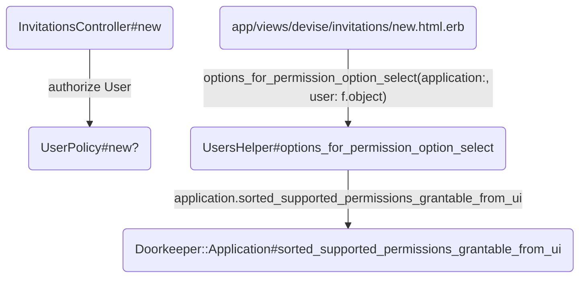

#### Invitations create

These dependencies determine whether a user can:

- complete the controller action

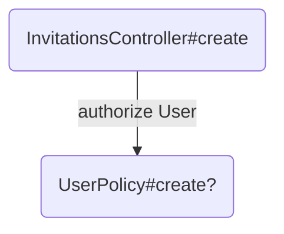

## Important files

### Models

| Class                                                                    | Relevant associations                                                                       |
|--------------------------------------------------------------------------|---------------------------------------------------------------------------------------------|
| [Doorkeeper::Application](/app/models/doorkeeper/application.rb)         | Has many supported permissions                                                              |
| [SupportedPermission](/app/models/supported_permission.rb)               | Belongs to an app                                                                           |
| [UserApplicationPermission](/app/models//user_application_permission.rb) | Joins users with supported permissions (and apps), determining what individual users can do |

### Controllers

| Class                                                                                             | Responsibility                                                                     |
| ------------------------------------------------------------------------------------------------- | ---------------------------------------------------------------------------------- |
| [Account::ApplicationsController](/app/controllers/account/applications_controller.rb)            | Rendering index and individual pages for own app permissions                       |
| [Account::PermissionsController](/app/controllers/account/permissions_controller.rb)              | Managing own permissions                                                           |
| [Account::SigninPermissionsController](/app/controllers/account/signin_permissions_controller.rb) | Managing own access to apps                                                        |
| [InvitationsController](/app/controllers/invitations_controller.rb)                               | Giving users access to apps and permissions while creating their account           |
| [Users::ApplicationsController](/app/controllers/users/applications_controller.rb)                | Rendering index and individual pages for other users' app permissions              |
| [Users::PermissionsController](/app/controllers/users/permissions_controller.rb)                  | Managing other users' permissions                                                  |
| [Users::SigninPermissionsController](/app/controllers/users/signin_permissions_controller.rb)     | Managing other users' access to apps                                               |

### Policies

| Class                                                                     | Responsibility                                                                                                                                                            |
|---------------------------------------------------------------------------|---------------------------------------------------------------------------------------------------------------------------------------------------------------------------|
| [Account::ApplicationPolicy](/app/policies/account/application_policy.rb) | Determining whether granters can see and update their own access and permissions                                                                                          |
| [SupportedPermissionPolicy](/app/policies/supported_permission_policy.rb) | Determining which permissions can be updated by a given granter                                                                                                           |
| [UserPolicy](/app/policies/user_policy.rb)                                | Determining whether a granter can update a grantee's access and permissions*, and whether they can invite a new user and grant them access and permissions in the process |
| [Users::ApplicationPolicy](/app/policies/users/application_policy.rb)     | Determining whether a granter can see and update a grantee's access and permissions*                                                                                      |

\* the responsibility of these two policies is hard to distinguish in this context, but as seen in the dependency trees for existing users, the `Users::ApplicationPolicy` depends on the `UserPolicy`, and in reality the latter is larger in scope. The `InvitationsController` depends on different parts of the `UserPolicy`, for instance.

### Others

| Class                                                                               | Responsibility                                                                                 |
|-------------------------------------------------------------------------------------|------------------------------------------------------------------------------------------------|
| [ApplicationTableHelper](/app/helpers/application_table_helper.rb)                  | Generating links to view/manage access and permissions dependent on policy-based authorisation |
| [SupportedPermissionParameterFilter](/lib/supported_permission_parameter_filter.rb) | Ensuring granters can only change permissions they're authorised to manage                     |
| [UserUpdate](/app/services/user_update.rb)                                          | Updating a user's permissions                                                                  |
| [UserUpdatePermissionBuilder](/app/models/user_update_permission_builder.rb)        | Generating a list of updated permissions                                                       |
| [UsersHelper](/app/helpers/users_helper.rb)                                         | Generating a list of permissions that can be granted when creating a new user                  |
